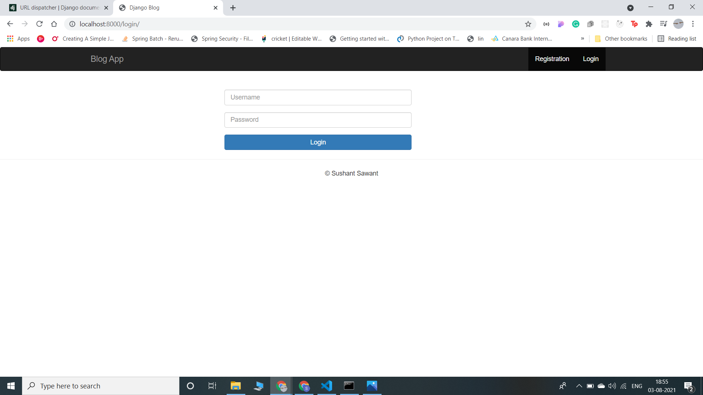
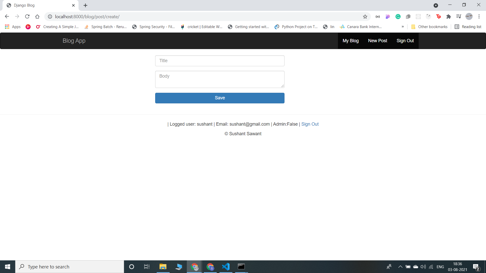
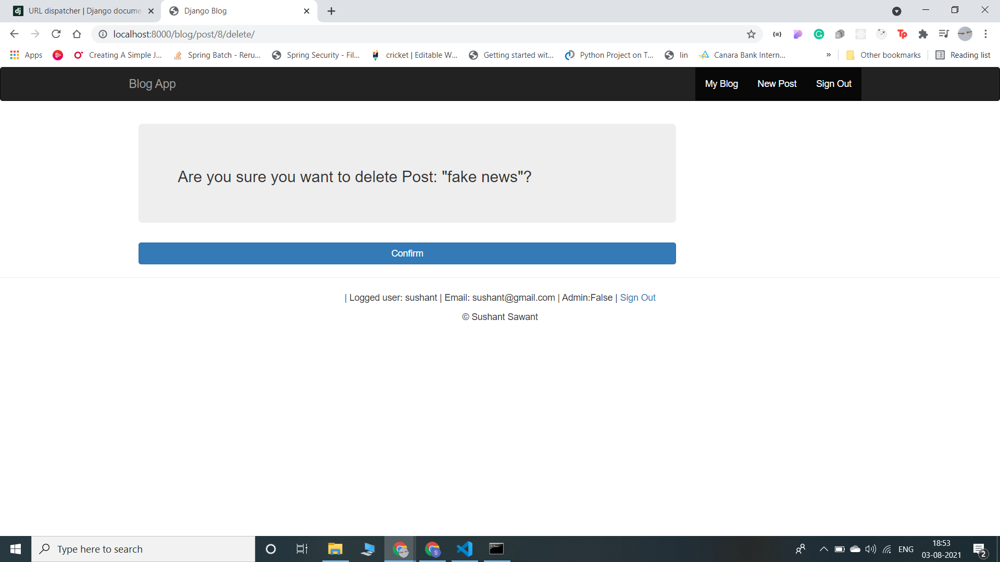

# Django Blog Demo
It was made using **Python 3.6** + **Django** and database is **SQLite**.
**Bootstrap** was used for styling.

There is a login and registration functionality included.

User has his own blog page, where he can add new blog posts. 
Every authenticated user can comment on posts made by other users.
Home page is paginated list of all posts.
Non-authenticated users can see all blog posts, but cannot add new posts or comment. 

Screenshots of website:  

**Register page**  
 

**Login page**  
 

**Home page**  
 

**Pagination page-1**  
 

**Pagination page-2**  
 

**when user clicks on any blog**  
 

**List of all blogs of logged in user**  
 

**Adding new blog**  
 

**When user clicks on delete button of blog**  
 

**Admin page-1**  
 

**Admin page-2**  
 
